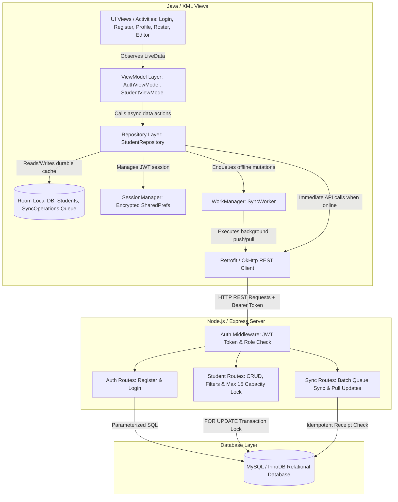

# ICT361 System Architecture Diagram & Data Flow

This document details the multi-layered architecture of the **Android Student Registration and Lab Group Management Application** in accordance with Unit 3 (slides 6–11, 19–23, 30–36) and Unit 5 (slides 29–42).

---

## Architecture Principles Applied

1. **Separation of Concerns**:
   - **UI Views** (`Activity` / `Adapter`): Display state and collect user gestures. Form inputs and search state survive screen rotation (`ViewModel`).
   - **ViewModels** (`AuthViewModel`, `StudentViewModel`): Expose `LiveData` streams. Do not reference `Context` directly to avoid memory leaks.
   - **Repository** (`StudentRepository`): Single source of truth. Coordinates local Room cache and remote Retrofit network API calls.
   - **Room Database** (`AppDatabase`): Durable local storage for student profiles and pending sync operation queues (`sync_operations`). Work survives process death and device restarts.
   - **WorkManager** (`SyncWorker`): Persistent background synchronization with `NetworkType.CONNECTED` constraint and exponential retry backoff.
   - **Express REST Backend**: Validates input server-side, checks JWT permissions, enforces the **maximum 15 active members per lab group** using MySQL/InnoDB row-level locking (`FOR UPDATE`), and records operation receipts for idempotent sync replay.
